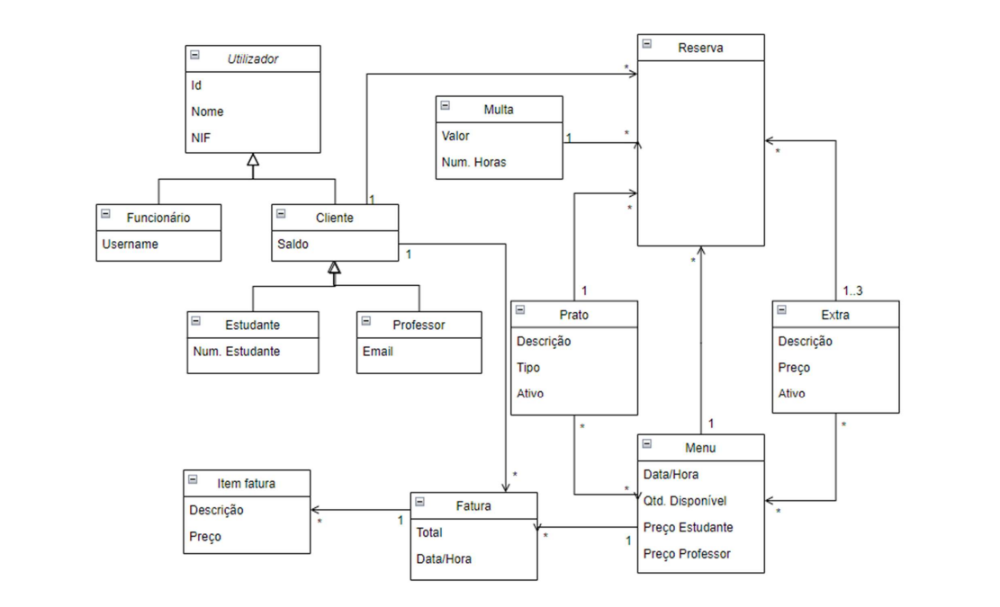
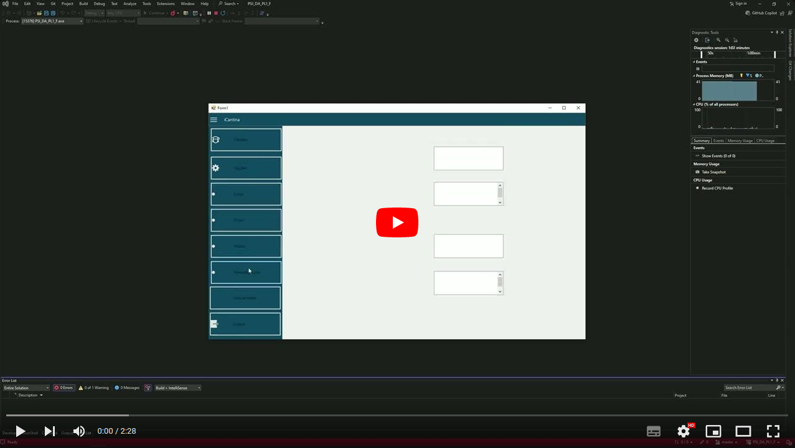

# C# .NET Framework - Projeto Cantina

## Projeto de um sistema de gestão de uma cantina com acompanhamento da metodologia ágil (SCRUM)

Este projeto é sobre um sistema de gestão de uma cantina que permita gerir os menus, reservas, clientes e funcionarios. Para isso, será necessário um software que implemente todas as funcionalidades:

* Gerir os menus dos dias de uma determinada semana
* Controlar as reservas
* Gerir clientes
* Gerir funcionários
* Efetuar a faturação das reservas

## Modelo de dados do projeto

## Exemplo do projeto

## Como instalar o projeto na sua máquina

A forma mais simples de correr a aplicação na sua máquina é:

1. Clonar o projeto
2. Instalar a extensão "NuGet-Tools"
3. Instalar as NuGet Packages "EntityFramework", "iTextSharp" e "ReaLTaiizor" a partir do NuGetManager
4. Mudar a directoryPath string no "ControllerReserva" para um válido na sua máquina
5. Iniciar a aplicação

Projeto realizado por:  
* Miguel Carpinteiro  Nº 2231992
* Manuel Lopes        Nº 2231647
* Miguel Silva        Nº 2231683

Projeto coordenado pelos docentes:  
**Diana Santos de Metodologias de Desenvolvimento de Software**  
**Luis Barreiro de Desenvolvimento de Aplicações**
